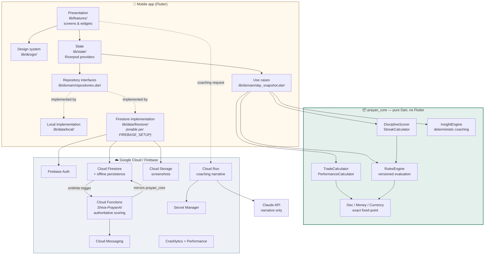

# Prayan Trading Journal — Product Blueprint

> Plan the trade. Follow the rules. Measure the discipline. Improve the process.

This document is deliverables **A–S** from §34 of the master brief. It is the
reference for what was built, why, and what remains.

---

## A. Executive product summary

Prayan is a mobile trading journal whose primary output is **not** profit and
loss — it is an explainable 0–100 **Discipline Score** measuring how closely a
trader followed rules they set for themselves.

The product exists because the feedback loop in trading is broken: outcome and
process are only loosely correlated over short horizons, so a trader who judges
themselves by P&L is training on noise. Prayan separates the two. A losing trade
that respected every rule scores 100. A profitable trade that broke a major rule
is capped at 60 and resets the clean streak.

That inversion is enforced structurally, not by convention: `DisciplineScorer`
takes only `RuleEvaluation` objects as input. It has no access to P&L at all, so
it is *incapable* of rewarding a profitable rule-break. See
`packages/prayan_core/lib/src/scoring/discipline_score.dart`.

**Not** in scope, permanently: order placement, broker credentials, profit
predictions, signals, copy-trading, leaderboards.

---

## B. Assumptions and decisions taken

Decisions made without blocking, as the brief instructs. Each is reversible.

| # | Decision | Reasoning |
|---|---|---|
| 1 | **Flutter + Dart** | As specified. One codebase, native-feeling on both platforms, and a mature test story. |
| 2 | **Riverpod**, not BLoC or Provider | Compile-time-safe providers, trivially overridable in tests, and readable without a `BuildContext`. Most of this app's state is *derived* from pure functions, which suits Riverpod's computed-provider model. |
| 3 | **No code generation** (no freezed / json_serializable / riverpod_generator) | Hand-written `copyWith`/`toMap` costs a few hundred lines once. Codegen costs a `build_runner` step in every developer's loop and every CI run, and generated files are unreviewable in a PR. For a codebase this size the trade favours hand-written. |
| 4 | **Custom fixed-point `Dec` type**, not the `decimal` package | Money arithmetic is the one thing that must never change behaviour underneath us. Zero dependencies means zero risk of a transitive upgrade altering a rounding mode. ~250 lines, 21 tests. |
| 5 | **Domain engine as a separate pure-Dart package** | `packages/prayan_core` has no Flutter import, so it runs on the plain Dart VM, is mirrored by the Cloud Functions backend, and can be reused by a future web client without touching UI code (§29). |
| 6 | **Local-first repositories ship today; Firestore is an additive swap** | Generating `firebase_options.dart` requires a real Firebase project. Rather than ship a build that compiles and then fails at launch, the app runs fully on device-local persistence behind the same interfaces. See §J and `docs/FIREBASE_SETUP.md`. |
| 7 | **Trading day = `yyyy-MM-dd` in the user's timezone, precomputed on the trade** | Grouping by day is the hottest query in the app and must not depend on the reader's clock. |
| 8 | **Timezone as a UTC *offset* at the domain boundary** | Keeps `prayan_core` dependency-free. The app layer resolves the IANA zone to the offset in effect *at that instant*, so DST transitions stay correct. |
| 9 | **Breakeven band = 2% of planned risk** | A ₹40 result on ₹2,000 of risk is a scratch, not a win. Scaling the band to the trade's own risk is more honest than a fixed currency amount. |
| 10 | **Sample data is opt-in** | A journal pre-filled with trades the user did not take is dishonest. Offered explicitly at onboarding step 12, tagged `sample`, removable in one tap. |
| 11 | **Portrait only** | A vertical-list, one-handed product. A second layout for every screen with no use case asking for it is waste. |

### Questions for the product owner

None are blocking; defaults are in place.

1. **Multi-account**: the data model supports many accounts; the UI currently
   exposes one. Do users need to journal several accounts in parallel in v1?
2. **Streak semantics**: a no-trade day currently *preserves* a streak without
   extending it. Configurable in Settings; is the default right?
3. **Major-violation cap** defaults to 60. Should the ceiling be lower?
4. **Partial exits**: the data model supports them fully and the calculator
   handles them; the *entry form* currently writes one entry and one exit fill.
   Priority for the multi-fill editor?

---

## C. MVP vs Phase 2

### Shipped (MVP)

| Brief requirement | Status |
|---|---|
| Premium onboarding | 12 steps, `features/onboarding/` |
| Auth | Email/password working; Google/Apple wired to interfaces, need Firebase |
| Settings, currency, timezone, theme | 4 themes, 12 currencies, IANA zones |
| Rule setup | Full builder, 20 measures, 3 severities, versioned |
| Quick trade entry | `features/trade/trade_log_screen.dart`, live risk preview |
| Trade history / detail / edit | Search, filter by outcome and violations |
| Automatic calculations | `TradeCalculator`, 42 tests |
| Rule evaluation | `RulesEngine`, 21 tests |
| Discipline score | `DisciplineScorer`, 17 tests, fully explainable |
| Clean streak | `StreakCalculator`, 29 tests, history preserved |
| Calendar | Month heatmap, accessible without colour |
| Daily review | Guided, 6 prompts |
| Basic analytics | Equity curves, 6 breakdowns, expectancy, profit factor, drawdown |
| Notifications | Preferences model + quiet hours; scheduling needs FCM |
| Offline-safe | Local-first by construction; idempotent writes |
| Secure backend | Rules + indexes written; deploy per `FIREBASE_SETUP.md` |
| Core tests | **201 tests**, zero analyzer issues |

### Phase 2

Deeper psychology correlations · advanced analytics (MAE/MFE, R-distribution
histograms) · PDF export · AI-written coaching (backend exists, needs
deployment) · CSV/broker import · subscription entitlements · web dashboard ·
multi-fill trade editor · screenshot annotation.

---

## D. User journeys

**First run (≈2 min)** → Splash → sign up → 12 onboarding steps → dashboard,
with rules already live so the first trade is scored.

**Logging a trade (target 20–30 s)** → tap the persistent *Log trade* action →
symbol, direction, entry, stop, target, quantity → live risk readout updates on
every keystroke → any rule breach is shown **before** saving → save.

Everything else — psychology, notes, tags, confidence, reflection — sits behind
*More details*. Progressive disclosure is what makes the 20-second path real.

**Closing the day** → dashboard shows the score and one coaching line → Daily
Review → six prompts → *Close the day*, which satisfies the
`dailyReviewCompleted` rule if configured.

**Weekly reflection** → discipline trend and weakest rule **first**, money
second. The ordering is the intervention.

---

## E. Information architecture

```
Prayan
├── Home (dashboard)          discipline · limits · coaching · today
├── Journal                   search, filter, grouped by day
├── Calendar                  month heatmap → daily review
├── Analytics                 curves, breakdowns, averages
└── Profile                   account · rules · psychology · reviews · settings

Reachable from anywhere: Quick Log Trade (floating action)
```

Five primary destinations, the ceiling implied by §24. Quick Log is a floating
action rather than a sixth tab because it must be one thumb movement away.

---

## F. Screen list

25 screens, all built:

Splash · Onboarding (12 steps) · Sign in/up · Home · Quick Log Trade · Trade
Detail · Edit Trade · Trade History · Rules · Rule Builder · Discipline Detail ·
Consistency/Streak (in Discipline Detail) · Calendar · Daily Review · Analytics ·
Psychology · Weekly Review · Monthly Review · Profile · Accounts · Currency ·
Timezone · Themes · Privacy · Export/Delete · Help/About (in Settings).

---

## G. Design system

`lib/design/`. Full detail in **[DESIGN_SYSTEM.md](DESIGN_SYSTEM.md)**.

- **Tokens** — 4pt spacing grid, one card radius (18), motion capped at 620 ms
  and collapsed to zero under reduced-motion.
- **Type** — platform UI sans for prose; **tabular figures everywhere numbers
  are compared**, because proportional digits make a trade list unscannable.
- **Colour** — 24 semantic roles, 4 palettes. Widgets never name a hex value.
  Positive is a desaturated teal, negative a muted terracotta — never a trading
  terminal's red/green. WCAG AA is asserted in `test/theme_contrast_test.dart`.
- **Redundancy** — colour is *never* the sole carrier of meaning: signs on every
  P&L, filled-vs-hollow result dots, text legends, semantic labels. Asserted in
  `test/result_semantics_test.dart`.
- **Components** — `MetricCard`, `LimitMeter`, `ScoreRing`, `ScoreBar`,
  `RuleStatusTile`, `SeverityChip`, `TradeRow`, `CalendarDayCell`,
  `ChartContainer`, `PrayanCard`, `SectionHeader`, `DetailRow`, `EmptyState`,
  `ErrorState`, `Skeleton`, `SyncBanner`, `CoachingCard`, `CoachingStrip`,
  `DisclaimerNote`, `PrayanSegmentedControl`, `PrayanChoiceChip`,
  `OutcomeSplitBar`, `confirmAction`.

---

## H. Technical architecture



**The one structural idea**: `prayan_core` is the single source of truth for
every authoritative number. The client runs it for instant feedback; Cloud
Functions runs the identical logic to produce the *stored* score. A tampered
client can write a trade but cannot write a score.

### Layering rules (enforced by import direction)

| Layer | May import | Must never import |
|---|---|---|
| `prayan_core` | nothing | Flutter, Firebase, `dart:io` |
| `lib/domain` | `prayan_core` | Flutter widgets, any `lib/data` |
| `lib/data` | `prayan_core`, `lib/domain` | `lib/features`, `lib/design` |
| `lib/state` | `prayan_core`, `lib/domain` | `lib/features` |
| `lib/features` | everything above | another feature's internals |

---

## I. Database schema

Firestore, user-scoped. Full document shapes in
**[DATA_MODEL.md](DATA_MODEL.md)**.

```
users/{uid}
  profiles/{uid}
  appPreferences/{uid}
  notificationPreferences/{uid}
  accounts/{accountId}
  strategies/{strategyId}
  checklistItems/{itemId}
  rules/{ruleId}                    ← current version inline
    ruleVersions/{versionId}        ← immutable history
  trades/{tradeId}                  ← executions[] embedded
  tradeRuleEvaluations/{tradeId}    ← server-written
  dailySummaries/{yyyy-MM-dd}       ← server-written, authoritative score
  weeklySummaries/{yyyy-Www}
  monthlySummaries/{yyyy-MM}
  reviews/{dayKey}
  psychologyEntries/{entryId}
  behaviourWatches/{watchId}
  attachments/{attachmentId}
  auditEvents/{eventId}             ← append-only, server-written
```

**Rule versioning is the schema's load-bearing decision.** Editing a rule closes
the live version at `effectiveToUtc` and opens a new one — it never mutates.
Every instant maps to exactly one version, no gaps and no overlap, so a trade
from March is always judged by March's thresholds. Without this, tightening a
limit would retroactively turn a compliant month into a violation-riddled one.

**Money is stored as a decimal string**, never a float. `"1234.56"`, not
`1234.56`. Firestore numbers are IEEE-754 doubles and would corrupt the value.

Indexes: `firebase/firestore.indexes.json`.

---

## J. Security model

1. **Data isolation** — every document is under `users/{uid}`; rules deny any
   read or write where `request.auth.uid != uid`. No collection-group query can
   cross the boundary.
2. **Scores are server-written** — clients have `allow write: if false` on
   `dailySummaries`, `tradeRuleEvaluations` and `auditEvents`. Only the Cloud
   Function service account writes them. This is §4's "never trust
   client-calculated scores" made structural.
3. **Rule history is immutable** — `ruleVersions` allows create but never update
   or delete, so the audit trail cannot be rewritten.
4. **Schema validation in rules** — required fields, types and value ranges are
   checked server-side; a malformed trade is rejected at the door.
5. **No secrets in the app** — the Claude API key lives in Secret Manager and is
   only ever read by the Cloud Run service. The mobile app calls that service
   with a Firebase ID token and never sees a provider key.
6. **Data minimisation** — the coaching payload carries *no* symbols, prices,
   sizes or balances. Only computed counts and pre-formatted summary strings.
   Asserted in `packages/prayan_core/test/scenario_brief_39_test.dart`.
7. **Deletion** — `deleteAccount()` removes documents, not just the login.

Rules: `firebase/firestore.rules`, `firebase/storage.rules`.

---

## K. Rules engine specification

`packages/prayan_core/lib/src/rules/rules_engine.dart`.

**20 measures** across three scopes:

*Trade scope* — `maxRiskPercentPerTrade`, `maxRiskMoneyPerTrade`,
`minPlannedRewardRisk`, `stopLossRequired`, `approvedStrategyOnly`,
`sessionRestriction`, `checklistCompletion`, `notesRequired`,
`screenshotRequired`, `noAddingToLosers`.

*Day scope* — `maxTradesPerDay`, `maxDailyLossMoney`, `maxDailyLossPercent`,
`maxDailyLossR`, `maxConsecutiveLosses`, `noTradingAfterDailyStop`,
`dailyReviewCompleted`, `manualCustom`.

*Week scope* — `maxWeeklyLossMoney`, `maxWeeklyLossR`.

**Four outcomes**, and the distinction between the last two is the point:

| Status | Meaning | In the score? |
|---|---|---|
| `passed` | Applied and followed | Yes, numerator + denominator |
| `violated` | Applied and broken | Yes, denominator only |
| `notApplicable` | Did not apply (wrong day, paused, trade not taken) | **No** — excluded entirely |
| `indeterminate` | Applied but data missing to judge | **No** — surfaced for the user to complete, *never* a silent pass |

**Three severities** — `info` (recorded, never scores), `warning` (reduces the
score), `major` (reduces, caps the day, resets the streak).

Notable behaviours:
- **Historical version resolution** — `rule.versionAt(trade.openedAtUtc)`.
- **A planned or cancelled trade cannot break an execution rule.** Declining a
  setup is discipline, not activity (§37).
- **`noAddingToLosers`** is detected deterministically: an entry fill priced
  worse than the running weighted-average entry.
- **`noTradingAfterDailyStop`** walks trades in true time order and uses the
  *tightest* configured daily-loss limit, so a user with both a money and an R
  stop is held to whichever binds first.
- **`sessionRestriction`** treats its session list as the *allowed set*, not a
  context filter — otherwise the rule could never fail.

---

## L. Discipline score formula with worked examples

```
For each category c that applied today:
  categoryScore(c) = 100 × Σ(weight of passed rules in c)
                         ────────────────────────────────
                           Σ(weight of applied rules in c)

  normalisedWeight(c) = 100 × configWeight(c) / Σ configWeight(applied categories)

  contribution(c) = categoryScore(c) × normalisedWeight(c) / 100

score = Σ contribution(c)                            → clamped to [0, 100]
if any major violation:  score = min(score, majorViolationCap)   → default 60
```

Default weights (§38): risk 25 · stop 15 · R:R 15 · setup 15 · daily limits 15 ·
checklist 10 · journal 5. User-adjustable; **normalisation over applied
categories only** is what makes a user with no checklist configured not lose
10 points for it.

### Worked example 1 — normalisation

Risk rule passed, checklist rule broken. Nothing else applies.

```
applied categories: riskLimit (25), checklist (10)
riskLimit:  100 × 25/35 = 71.4
checklist:    0 × 10/35 =  0.0
score = 71.4
```

### Worked example 2 — the major-violation cap

Six categories fully compliant, stop-loss rule (major) broken.

```
uncapped        = 84.6
major violation → cap at 60
score           = 60,  wasCappedByMajorViolation = true
```

The uncapped figure is retained and displayed: *"Without the cap it would have
been 85."* The user sees exactly what the breach cost.

### Worked example 3 — the brief's §39 scenario

Equity ₹5,00,000 · max risk 1% · min R:R 1:2 · max 3 trades/day · 2R daily stop ·
approved: Breakout, Pullback. Verified end-to-end in
`packages/prayan_core/test/scenario_brief_39_test.dart` (27 assertions).

| | Setup | Risk | Planned R:R | Result | Score |
|---|---|---|---|---|---|
| Trade 1 | Pullback ✓ | 0.8% ✓ | 1:2.4 ✓ | **−1R** | **100** |
| Trade 2 | Breakout ✓ | 1.0% ✓ | 1:2.1 ✓ | **+2R** | **100** |
| Trade 3 | Impulse ✗ | 1.8% ✗✗ | 1:2.0 ✓ | **+2.2R** | **≤60** |

Trade 1 **lost money and scored 100.** Trade 3 **made money and scored 60.**
The day finished net profitable and is still capped at 60. The clean streak
resets to zero while `bestCleanStreak`, `lifetimeAverageScore` and every prior
day's record remain untouched.

Audit line: *"Your score is 60 because 6/9 applicable rules were followed;
Maximum risk per trade, Hard risk ceiling and Approved setups only were broken.
A major rule was broken, so the day is capped at 60."*

---

## M. Calculation specification

`packages/prayan_core/lib/src/calc/`. All arithmetic on `Dec` (BigInt-backed
fixed point). Working scale 10; rounding happens once, at display.

```
avgEntry        = Σ(price × qty) / Σ qty            over entry fills
avgExit         = Σ(price × qty) / Σ qty            over exit fills
closedQty       = min(entryQty, exitQty)
grossPnL        = ±(avgExit − avgEntry) × closedQty × multiplier   ± by direction
netPnL          = grossPnL − Σ fees
riskPerUnit     = |entry − stop|
plannedRisk     = riskPerUnit × qty × multiplier
plannedRisk%    = plannedRisk / equityAtOpen × 100
plannedR:R      = |target − entry| / riskPerUnit
realisedR       = netPnL / plannedRisk
outcome         = |netPnL| ≤ 2% of plannedRisk ? breakeven : sign(netPnL)

winRate         = wins / closedTrades × 100
expectancy      = P(win)×avgWin − P(loss)×avgLoss
expectancyR     = Σ R / count(R defined)
profitFactor    = grossProfit / grossLoss           null when grossLoss = 0
maxDrawdown     = max(runningPeak − runningEquity)
```

**Every metric that cannot be determined is `null`, never `0`.** No stop means
`plannedRisk == null` and `realisedR == null` — not zero, which would make R
infinite and silently poison every aggregate downstream. This one rule is why
the calculator's return type is nullable throughout.

Handled and tested: shorts, contract multipliers (futures/options), 8-decimal
crypto quantities, partial exits, scale-ins, missing stops, zero fees, JPY's
zero minor units, Indian lakh/crore grouping, and 1000-iteration accumulation
with zero drift.

Rounding: half-up for display, half-even available for long series. Prices keep
full entered precision; money rounds to the currency's minor unit at render.

---

## N. Notification design

Seven types, all off-able, all with quiet hours (default 21:30–07:00):
pre-market plan · journal incomplete · end-of-day review · weekly review ·
streak milestone · daily risk-limit warning · "done for today" confirmation.

**Editorial constraint, enforced in code**: no notification encourages taking a
trade. Every one is about *finishing a record* or *stopping*. Streak milestones
are sparse by design — 3, 7, 14, 30, 60, 90, then every 30 — because a daily
nudge would be the dark pattern §32 forbids.

---

## O. Analytics specification

**Product analytics**: opt-in, default **off**. Events carry no symbols, prices,
sizes or balances — only screen names and coarse counts.

**Trading analytics** (what the user sees): P&L and R curves, expectancy, profit
factor, win rate, average win/loss, max drawdown in money and R, planned vs
realised R:R, average hold time; breakdowns by setup, direction, weekday,
session, emotion and mistake.

Guardrails: every metric has a plain-language tooltip; samples under 20 trades
are explicitly labelled *"a first look, not a measured edge"*; undefined metrics
render as `—`; nothing implies past results predict future ones.

---

## P. Project structure

```
Shiva-Prayan/
├── packages/prayan_core/          # pure Dart domain engine — 157 tests
│   ├── lib/src/money/             # Dec, Money, Currency
│   ├── lib/src/models/            # Trade, Rule, Account, enums
│   ├── lib/src/calc/              # TradeCalculator, PerformanceCalculator
│   ├── lib/src/rules/             # RulesEngine, RuleTemplates
│   ├── lib/src/scoring/           # DisciplineScorer, StreakCalculator
│   ├── lib/src/coaching/          # CoachingFacts, InsightEngine
│   └── lib/src/util/              # TradingDay
├── lib/
│   ├── app/                       # bootstrap, router, shell, root widget
│   ├── design/                    # tokens, palette, typography, theme
│   │   └── components/            # 23 reusable components
│   ├── domain/                    # models, repository interfaces, DaySnapshot
│   ├── data/local/                # LocalStore + repository implementations
│   ├── state/                     # Riverpod providers
│   └── features/                  # 13 feature folders
├── test/                          # 44 widget/accessibility tests
├── firebase/                      # firestore.rules, indexes, storage.rules
└── docs/                          # this file, DESIGN_SYSTEM, DATA_MODEL,
                                   # FIREBASE_SETUP, TESTING, RELEASE_CHECKLIST
```

---

## Q. Development roadmap

| Phase | Work | Status |
|---|---|---|
| 0 | Domain engine, money, calculations, rules, scoring | ✅ 157 tests |
| 1 | Design system, 4 themes, 23 components | ✅ contrast-tested |
| 2 | Data layer, repositories, state | ✅ local-first |
| 3 | Onboarding, auth, dashboard, trade log | ✅ |
| 4 | Rules, discipline, calendar, analytics, reviews, psychology, settings | ✅ |
| 5 | Firebase enablement + Cloud Functions scoring | Rules and functions written; needs a project |
| 6 | FCM scheduling, screenshot upload, biometric lock | Interfaces exist |
| 7 | TestFlight / Play internal testing | Checklist ready |
| 8 | AI coaching (Shiva-PrayanAI) | Service written; needs deploy |
| 9 | PDF export, CSV import, subscriptions, web | Phase 2 |

---

## R. Testing strategy

**201 tests, zero analyzer issues** across both packages.

| Suite | Tests | Covers |
|---|---|---|
| `dec_test` | 21 | Parsing, exact arithmetic, 5 rounding modes, 1000-iteration drift |
| `money_test` | 19 | Indian/Western grouping, JPY zero-decimals, currency mismatch |
| `trade_calculator_test` | 42 | Long/short, multipliers, partial exits, validation, round-trip |
| `performance_metrics_test` | 18 | Expectancy, profit factor, drawdown, grouping |
| `rules_engine_test` | 21 | Every measure, **rule versioning**, day and week scope |
| `discipline_score_test` | 17 | Weighting, normalisation, major cap, process-over-profit |
| `streaks_test` | 16 | Reset semantics, history preservation, rolling windows |
| `trading_day_test` | 13 | IST/EST bucketing, **DST transitions**, leap years |
| `scenario_brief_39_test` | 27 | The brief's worked example, end to end |
| `theme_contrast_test` | 26 | WCAG AA across all 4 palettes |
| `result_semantics_test` | 18 | Colour-independence, screen-reader labels |

Deliberately covered because they are where journals break: timezone
boundaries, DST, negative and zero values, missing stops, short positions,
long decimals, currency formatting, rule-version changes, duplicate submission.

Device QA checklist: `docs/TESTING.md`.

---

## S. Store deployment checklist

Full version in **[RELEASE_CHECKLIST.md](RELEASE_CHECKLIST.md)**.

- Bundle IDs `com.prayan.tradingjournal` (+ `.dev`, `.staging`)
- Signing: Play App Signing; iOS distribution cert + provisioning
- Icons and splash for every density and device class
- Privacy: data-safety form and Apple nutrition label — declare journal content,
  optional analytics, **no** financial-account linkage
- **Account deletion in-app** — both stores require it; implemented
- Sign in with Apple — **mandatory** if Google sign-in ships
- Screenshots: 6.7"/6.1" iPhone, 12.9" iPad, Android phone/tablet
- Age rating: likely 17+/Mature for financial content — **verify against current
  policy before submission**
- TestFlight + Play internal testing before production
- Crash-free sessions ≥ 99.5% before rollout expands
- Staged rollout 5% → 20% → 50% → 100%, Crashlytics-gated
- Separate dev/staging/prod Firebase projects

> **Approval is not guaranteed.** Financial-adjacent apps get extra scrutiny.
> The areas most likely to draw questions — age rating, the "not financial
> advice" disclaimers, data-safety accuracy, and Apple's §3.1.1 rules if
> subscriptions are added — must be verified against current Apple and Google
> policy at submission time, not against this document.
